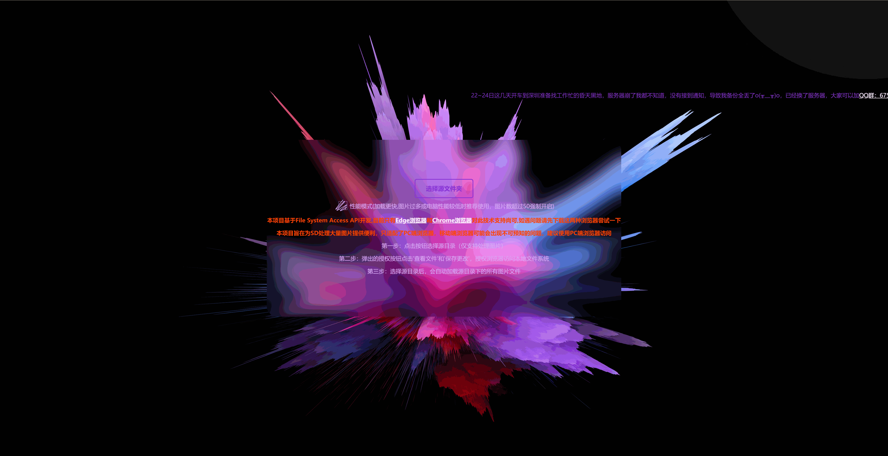

# sd筛图器介绍

基于[FileSystemAccessAPI](https://wicg.github.io/file-system-access/)开发的在线处理SD出图文件夹图片的工具,可以方便快捷的对SD图库进行清理,告别使用图片查看软件一个个低效的删除

[点击前往体验](https://longhao.tech/SDtool/)

项目预览



# 本地使用

## clone本仓库或者直接下载zip文件解压

```javascript
git clone https://github.com/longhaolh/sd_img_filter.git
```

```javascript
git clone https://gitee.com/longhao888/sd_img_filter.git
```

拉取或者解压后直接运行index.html文件即可

# 如果你有余力且觉得这个项目对你有帮助,欢迎支持,这将是对我的最大认可


# 更新日志

## v0.2.3

1. 新增删除目录前提示，防止误操作
2. 新增处理图片时的提示

## v0.2.2

1. 现在可以将网站作为PWA应用安装到windows系统桌面上了

## v0.2.1

1. 新增撤销功能，在未结束筛选、未刷新页面时可以使用快捷键ctrl+z撤销‘保存’、‘删除’操作
2. 新增三个快捷键，Ctrl+S，Ctrl+D，Ctrl+Z，Mac用户也可以用meta键+S+D+Z分别用于保存、删除、撤销，是不是一下子就顺手了呢^_^

## v0.2.0

1. 调整性能模式开启标准(200→50)
2. **新增还原模式,筛选完最后一张图片时会启动还原模式,删除deleteImgs、savedImgs文件夹下所有图片，并将savedImgs下的图片重写到源文件夹**
3. 对图片操作添加防抖函数，防止重复操作一张图片导致文件处理失败
4. 优化了权限提示文案
5. 性能模式开启时关闭loading显示来提升用户体验

## v0.1.4

1.修复了源文件夹图片处理完毕后界面渲染错误的问题

2.修复了未选择源文件夹时可以通过快捷键触发处理图片导致的逻辑错误

## v0.1.3

新增对移动端的访问限制

## v0.1.2

1.修改几处描述文案

2.将性能模式和自动删除进行了数据持久化,不用重复选择了

3.新增百度统计代码

## v0.1.1

修改了loading样式和文案

## v0.1.0

添加、删除图片功能已完成
